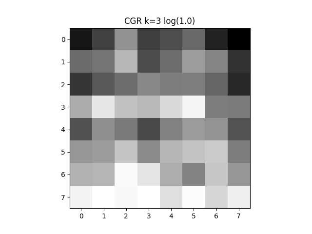

# CGR

Generates a Chaos Games Representation of an input sequence in FASTA format.

12 iterations of CGR for the SARSCOV2 genome where 

:

N.B. This is very much still a repo in the works, so is in no way polished for wide use.
